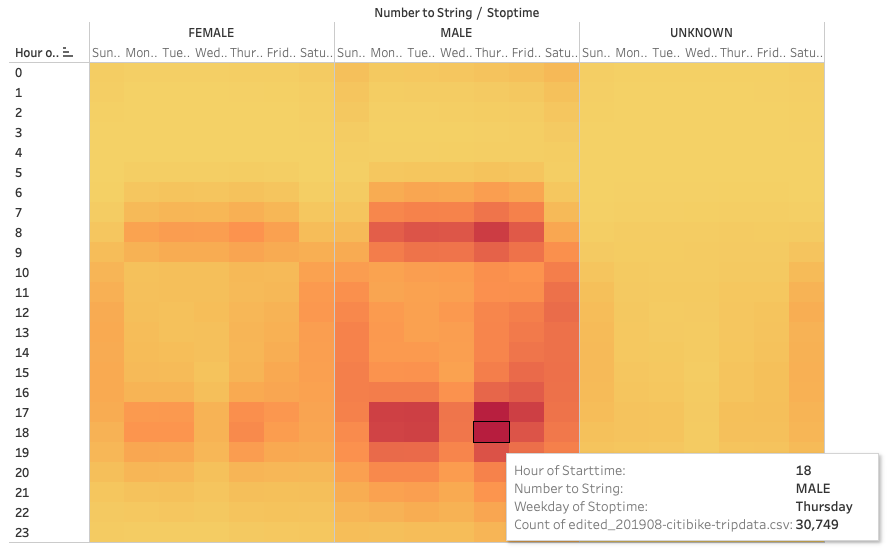
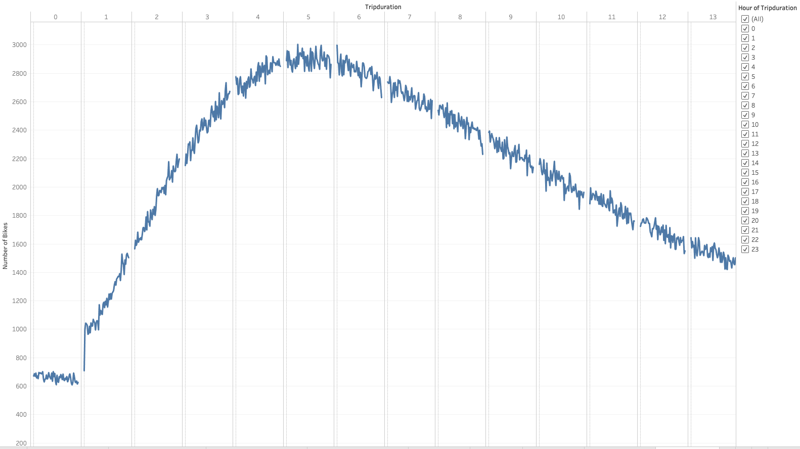

# Bikesharing

## OVERVIEW
We are exploring the idea of opening up CitiBike in Des Moines, Iowa. My friend, Kate, has a potential angel investor who might be interested in providing seed funding to explore a bike-share program in Des Moines. In addition to Kate's proposal, I have the data analytics experience and will figure out how this project will actually work.

## RESULTS

[link to dashboard](https://public.tableau.com/profile/jacob.sambajon#!/vizhome/BikesharingModule14Challenge/CitiBikeAnalysis "Link to Citibike Dashboard")

Here is an overview of all visualizations in a single dashaboard

This bar graph represents total number of rides by hour. The data shows that the window with the most riders is between 7p.m. and 9p.m.

This Pie Chart gives us a breakdown of Riders by gender. 65.3% of the riders are male, 25.1% or the riders are female, and 9.6% of the riders are unknown.

This heatmap represents the number of bike trips for each hour of each day of the week. The data shows that the bikes are used most during commute hours on weekdays and throughout the day on weekends.

This heatmap shows the number of bike trips by gender for each hour of each day of the week. Following our previous heatmap, The data shows that the bikes are used most during commute hours on weekdays and throughout the day on weekends. This heatmap shows that there is more bike usage amongst men.

This line graph displays the number of bikes checked out by duration for all users. The most frequent amount of trips last around 5 hours. Since this chart is skewed right, this means the average bike ride is usually longer than 5 hours.

This line graph shows the number of bikes that are checked out by duration for each gender by the hour, and the graph can be filtered by the hour and gender. Following our previous graph, this shows the same breakdown but includes a deeper analysis by including gender.

This heatmap shows the number of bike trips for each type of user and gender for each day of the week. The biggest demographic of users are male subscribers and the heaviest use is on Thursdays.

## SUMMARY

These data visualizations were able to help define the Des Moines marketing strategy though better understanding for our target demographic. The results shows that most customers are male riders during commute hours and all throughout the day on weekends.

I would reccommend these two additional visualizations for future analysis:

Identity which stations have the most trip starts and which stations have the most trip ends. This will give us an idea where to allocate more or less bikes.

Show stations that have the highest to lowest bike repairs and utilizations. This will help improve operations by idenityfing which bike need more upkeep and can identify which bikes to take out of rotation to increase safety of users.
